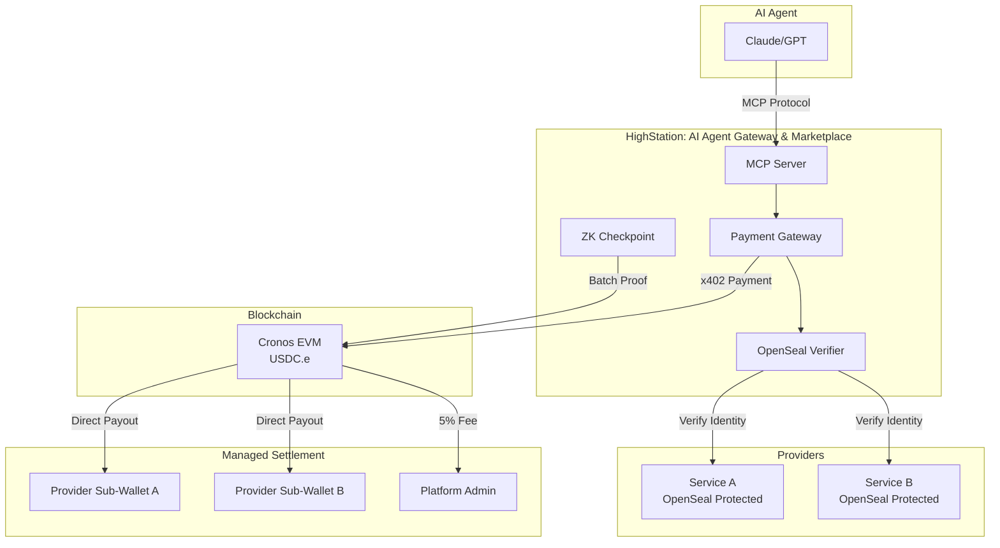

# HighStation 🚀

**The Trust Layer for AI Agents: Managed Infrastructure API Gateway**

[🇰🇷 한국어 버전](./README_KR.md)

HighStation is a **trust-based infrastructure platform** designed for autonomous AI agents in the Cronos ecosystem to use external API services safely and transparently. Moving beyond a simple proxy, we provide the core infrastructure that powers the autonomous AI economy.

---

## 🚀 Quick Start & Operations (A to Z)

For detailed instructions on deployment, local testing, and disaster recovery:

- **[Deployment Guide](./docs/internal/deployment/DEPLOYMENT.md)**: Zero-edit production setup via Docker & CI/CD.
- **[Local Testing Guide](./docs/internal/deployment/LOCAL_TESTING.md)**: HMR-enabled sandbox with Auth Bypass.
- **[Recovery Manual (KR)](./docs/internal/deployment/RECOVERY_MANUAL_KR.md)**: Step-by-step guide for server migration and zero-base recovery.

---

## 💡 Why HighStation? (Value Proposition)

For the AI agent economy to scale, an environment where agents can safely use "anonymous APIs" is essential.

- **🤖 For AI Agents**: "Trust mathematical proofs, not vague reputations." Using ZK and OpenSeal, agents can verify that services are untampered and performance is as claimed.
- **🛠️ For Service Providers**: "Build APIs, not payment systems." With x402 standards and managed sub-wallets, providers can monetize instantly without complex on-chain implementation.
- **🌐 For the Ecosystem**: We act as the **"Trust Layer"** of the autonomous economy, enabling agents to judge value and transact independently.

---

## 🆕 Evolution (v2.4 - Managed Infrastructure)

HighStation has evolved from a simple gateway into a **Managed Infrastructure Platform**.

- **🌐 Gateway Issuance (v2.2)**: Issuing unique `*.highstation.net` production endpoints for every registered service.
- **💳 Managed Sub-Wallet (v2.4)**: Automated on-chain deposit addresses per provider with 5% platform fee settlement.
- **📊 Real-Time Analytics**: Monitor actual traffic, revenue, and latency in 1-second intervals via 'Real Mode'.

---

## ✨ Core Features

### 🔐 OpenSeal & ZK Integrity (L1/L2)
- **L1 Code Integrity**: Verify that running code matches the public source via OpenSeal.
- **L2 Data Integrity**: Cryptographically guarantee performance claims (latency, etc.) using **ZK-SNARKs**.
- **Trust Score**: Quantitative reliability metric calculated as `0.6 * Reliability(ZK) + 0.2 * Latency + 0.2 * Price`.

### 💳 x402 Based Payments
- **HD Wallet Settlement**: Direct payouts to provider-specific on-chain addresses.
- **Real-Time Revenue Split**: 95% instant payout to providers after 5% platform fee deduction.
- **Optimistic Payments**: Ultra-low latency transactions via Trust Seeds.

### 🤖 AI-Native Interface
- **MCP (Model Context Protocol)**: Seamless tool discovery for Claude, GPT, and other LLMs.
- **Agent SDK**: Integration with `@highstation/sdk` for intent-based routing.

---

## 🔗 On-Chain Trust Verification

HighStation ensures transparency by anchoring all core metrics to the Cronos blockchain.

- **[ZKCheckpoint.sol](src/contracts/ZKCheckpoint.sol)**: Permanently anchors batch proofs of verified service performance metrics (latency, etc.).
- **[HighStationIdentity.sol](src/contracts/HighStationIdentity.sol)**: Issues ERC-721 based identity tokens to guarantee service provider ownership.
- **[PaymentHandler.sol](src/contracts/PaymentHandler.sol)**: Transparently verifies x402 payment data and on-chain settlement history.

---

## 🛠️ Tech Stack

- **Backend**: Node.js, TypeScript, Express 5 (Regex Routing)
- **Database**: PostgreSQL 15 (Hybrid: Supabase Auth + N100 Local Data)
- **Blockchain**: Cronos EVM (Testnet: ChainID 338)
- **Security**: Ed25519, Poseidon Hash, Groth16 ZK-SNARKs
- **AI Integration**: MCP Server, @highstation/sdk

---

---

## 🏗️ Platform Architecture

---

## 📂 Project Structure & Documentation

HighStation is a proprietary infrastructure platform. Documentation is categorized based on access level.

### 👤 Public Guides
- **[Provider Guide](docs/public/PROVIDER_GUIDE_EN.md)**: Register and monetize your services.
- **[Agent Integration](docs/public/AGENT_INTEGRATION_EN.md)**: Connect agents and use our SDK.
- **[Verification Guide](docs/public/VERIFICATION_GUIDE_EN.md)**: Demo with Easy AI Agent.
- **[Technical Architecture](docs/public/ARCHITECTURE_EN.md)**: Deep dive into ZK and OpenSeal trust models.

### 🛠️ Internal Resources
> [!NOTE]
> Detailed technical documentation for setup, deployment, and operations is restricted. For internal developers, please refer to the `docs/internal/` directory.
> - `deployment/QUICKSTART.md`: Local development setup (KR).
> - `deployment/LOCAL_TESTING.md`: Local node forking and ZK tests (KR).
> - `deployment/DEPLOYMENT.md`: Production CI/CD & Deployment (KR).
> - `deployment/RECOVERY_MANUAL_KR.md`: **Detailed Recovery Manual (KR)**.
> - `history/`: Project history and technical decision logs (KR).
