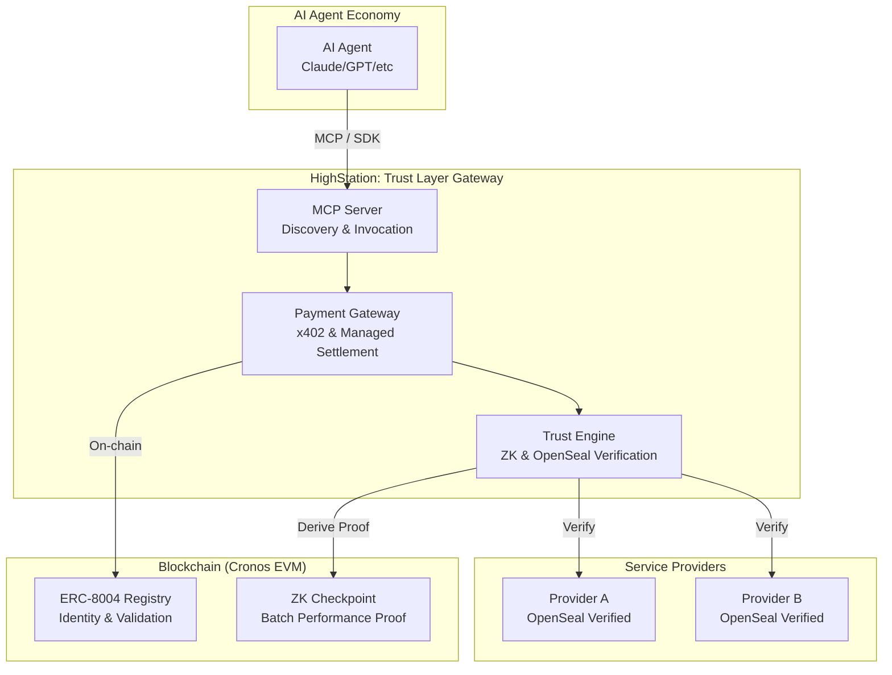

# HighStation 🚀

**The Trust Layer for AI Agents: ZK & OpenSeal Powered Managed API Gateway**

[🇰🇷 한국어 버전](./README_KR.md) | 🌐 [Website](https://highstation.net)

**"Invisible API servers—on what grounds can you trust them?"**

HighStation ensures **'Trusted API Services'** regardless of the provider by mathematically verifying source code integrity via **OpenSeal**.
Verified providers can legitimately demand **CRO** payments based on the **x402** protocol in exchange for proving their transparency. HighStation is the AI infrastructure bridging these trust-based autonomous transactions.

---

## 🎥 Demo

<!-- Add Demo Video URL below -->
*(Demo Video Placeholder)*

---

## 💡 Why HighStation? (Value Proposition)

For the AI agent economy to scale, an environment where agents can safely use "anonymous APIs" is essential.

- **🤖 For AI Agents**: "Trust mathematical proofs, not vague reputations." Using ZK and OpenSeal, agents can verify that services are untampered and performance is as claimed.
- **🛠️ For Service Providers**: "Build APIs, not payment systems." With x402 standards and managed sub-wallets, providers can monetize instantly without complex on-chain implementation.
- **🌐 For the Ecosystem**: By adhering to the ERC-8004 standard, we manage identities (NFTs), reputations, and validation records in an interoperable manner on the blockchain.

---

## 🛠️ Core Technologies

HighStation utilizes the following core technology stack to ensure 'Trust' for autonomous agents:

1.  **x402 (Standardized Payment)**: An ultra-low latency, optimistic payment interface between AI agents and service providers.
2.  **ZK-Proof (L2 Data Integrity)**: Cryptographically guarantees performance claims (latency, success rates, etc.) on-chain using **Groth16 ZK-SNARKs**.
3.  **OpenSeal Protocol (L1 Code Integrity)**: Verifies that running code matches the public source via Merkle Roots, ensuring 'Execution Integrity'.
4.  **ERC-8004 (Trustless Agents Standard)**: Standardizes agent and service identities (NFTs), reputations, and validation records in a public registry for objective ecosystem trust.

---

## 🏗️ Architecture

---

## 📚 Public Guides

Refer to the following documents for detailed guides on getting started and verifying the platform:

### 👤 Public Service Guides
- **[Provider Guide](docs/public/PROVIDER_GUIDE_EN.md)**: How to register your API and monetize via x402.
- **[Code Integrity Support (OpenSeal)](docs/public/OPENSEAL_INTEGRITY_GUIDE_EN.md)**: How to prove code integrity via OpenSeal SDK and register your tag.
- **[Verification Guide](docs/public/VERIFICATION_GUIDE_EN.md)**: How to verify the ZK and OpenSeal proofs provided by the platform.
- **[Try with Easy AI Agent](./easy-ai-agent/README_EN.md)**: Experience the HighStation trust layer directly with a CLI agent (no complex setup required).
- **[Agent Integration Guide](docs/public/AGENT_INTEGRATION_GUIDE_EN.md)**: How to integrate the HighStation SDK into your own AI agent.

---

## 🛡️ Security & Internal Structure
As a production-grade infrastructure platform, HighStation's core security logic and server configurations are kept private.
- For a deep dive into the architecture, see the **[Technical Architecture Whitepaper](docs/public/ARCHITECTURE_EN.md)**.
- Other internal planning and deployment documents have been excluded from the public repository for security reasons.

---

## 📜 Policies & License

### 🤝 Contributions
To ensure project stability and security, HighStation is currently **not accepting external contributions (Pull Requests).** Please report bugs or suggestions via Issues.

### ⚖️ License
HighStation's core interfaces and public tools are licensed under the **MIT License**. Some service engine software may follow separate licensing policies.

---

## 🔗 Links
- **GitHub**: [kjyyoung/HighStation](https://github.com/kjyyoung/HighStation)
- **Docs**: [docs/public/](docs/public/)
- **OpenSeal Project**: [OpenSeal Repository](https://github.com/kjyyoung/OpenSeal)
