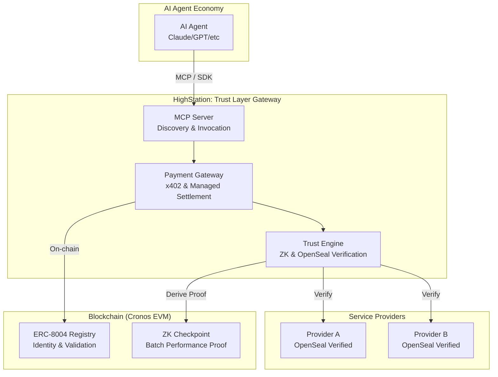

# HighStation 🚀

**AI 에이전트를 위한 신뢰 레이어: ZK & OpenSeal 기반 인프라형 API 게이트웨이**

[🇺🇸 English Version](./README.md)

HighStation은 Cronos 생태계의 자율 AI 에이전트가 안전하고 투명하게 외부 API 서비스를 이용할 수 있도록 설계된 **신뢰 기반 인프라 플랫폼**입니다. 단순한 프록시를 넘어, 암호학적 증명(ZK)과 표준 프로토콜(ERC-8004, x402)을 통해 AI 경제의 자율 거래를 지원하는 핵심 인프라를 제공합니다.

---

## 💡 Why HighStation? (가치 제안)

AI 에이전트 경제가 성장하기 위해서는 "누가 제공하는지 모르는 API"를 안심하고 쓸 수 있는 환경이 필요합니다.

- **🤖 AI 에이전트**: "모호한 평판 대신 수학적 증명을 믿으세요." ZK와 OpenSeal을 통해 성능 조작이 불가능한 검증된 서비스만 선별하여 이용할 수 있습니다.
- **🛠️ 서비스 제공자**: "결제 시스템 고민 없이 API만 준비하세요." x402 규격과 관리형 지갑을 통해 복잡한 온체인 결제 구현 없이 즉시 수익화가 가능합니다.
- **🌐 생태계**: ERC-8004 표준을 준수하여 에이전트와 서비스의 신원, 평판, 검증 결과를 블록체인 상에서 상호운용 가능한 형태로 관리합니다.

---

## 🛠️ 핵심 기술 (Core Technologies)

HighStation은 자율 에이전트의 '신뢰'를 위해 다음의 핵심 기술 스택을 사용합니다:

1.  **x402 (Standardized Payment)**: AI 에이전트와 서비스 제공자 간의 초저지연, 낙관적 결제 인터페이스.
2.  **ZK-Proof (L2 Data Integrity)**: 제공자의 성능 주장(지연시간, 성공률 등)을 **Groth16 ZK-SNARKs**로 온체인에서 암호학적으로 보증합니다.
3.  **OpenSeal Protocol (L1 Code Integrity)**: 실행 중인 코드가 공개된 소스와 일치하는지 Merkle Root를 통해 검증하여 '이행 무결성'을 보장합니다.
4.  **ERC-8004 (Trustless Agents Standard)**: 에이전트와 서비스의 신원(NFT), 평판, 검증 기록을 표준화된 레지스트리에 저장하여 생태계 신뢰를 객관화합니다.

---

## 🏗️ 아키텍처 (Architecture)

---

## 📚 사용 및 가이드 (Public Guides)

HighStation을 시작하고 검증하기 위한 상세 가이드는 아래 문서를 참조하십시오:

### 👤 공개 서비스 가이드
- **[공급자 가이드 (Provider Guide)](docs/public/PROVIDER_GUIDE_KR.md)**: 자신의 API를 등록하고 x402를 통해 수익화하는 방법.
- **[오픈실 무결성 가이드 (Code Integrity Support)](docs/public/OPENSEAL_INTEGRITY_GUIDE_KR.md)**: OpenSeal SDK를 통한 코드 무결성 증명 및 태그 등록 방법.
- **[검증자 가이드 (Verification Guide)](docs/public/VERIFICATION_GUIDE_KR.md)**: 플랫폼이 제공하는 ZK 및 오픈실 증명이 어떻게 작동하는지 확인하는 방법.
- **[Easy AI Agent로 사용해보기](./easy-ai-agent/README.md)**: 복잡한 설정 없이 CLI 에이전트로 HighStation의 신뢰 레이어를 직접 체험하는 방법.
- **[Agent 통합 가이드 (Integration)](docs/public/AGENT_INTEGRATION_GUIDE_KR.md)**: 자신의 AI 에이전트에 HighStation SDK를 연동하는 방법.

---

## 🛡️ 보안 및 내부 구조
HighStation은 상용 인프라 플랫폼으로서 핵심 보안 로직 및 서버 구성 환경은 비공개로 관리됩니다.
- 상세 아키텍처는 **[Architecture 기술 백서](docs/public/ARCHITECTURE_KR.md)**를 참조하십시오.
- 기타 내부 계획 및 배포 문서는 보안 정책상 퍼블릭 저장소에서 제외되었습니다.

---

## 📜 정책 및 라이선스

### 🤝 기여 (Contributions)
현재 HighStation은 프로젝트의 안정성과 보안을 위해 **외부 기여(Pull Request)를 받지 않고 있습니다.** 제안이나 버그 보고는 Issue를 통해 남겨주시기 바랍니다.

### ⚖️ 라이선스
HighStation의 핵심 인터페이스 및 공개 도구는 **MIT License**를 따릅니다. 단, 일부 서비스 엔진 소프트웨어는 별도의 라이선스 정책을 따를 수 있습니다.

---

## 🔗 링크
- **GitHub**: [kjyyoung/HighStation](https://github.com/kjyyoung/HighStation)
- **Docs**: [docs/public/](docs/public/)
- **OpenSeal Project**: [OpenSeal Repository](https://github.com/kjyyoung/OpenSeal)
