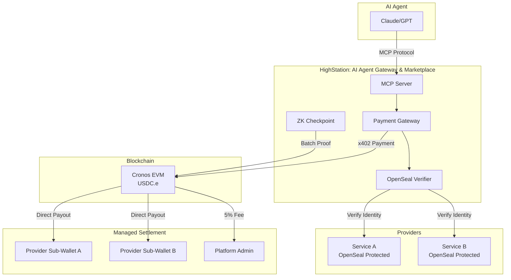

# HighStation 🚀

**AI 에이전트를 위한 신뢰 레이어: 인프라 관리형 API 게이트웨이**

HighStation은 Cronos 생태계의 자율 AI 에이전트가 안전하고 투명하게 외부 API 서비스를 이용할 수 있도록 설계된 **신뢰 기반 인프라 플랫폼**입니다. 단순한 프록시를 넘어, AI 경제의 자율 거래를 지원하는 핵심 인프라를 제공합니다.

---

## 🚀 빠른 시작 및 운영 가이드 (A to Z)

프로젝트 배포, 로컬 테스트 및 장애 복구에 대한 상세 가이드는 아래 문서를 참조하십시오:

- **[배포 가이드 (Deployment)](./docs/internal/deployment/DEPLOYMENT.md)**: Docker 및 CI/CD를 활용한 제로-에딧 배포 환경.
- **[로컬 테스트 가이드 (Testing)](./docs/internal/deployment/LOCAL_TESTING.md)**: HMR과 Auth Bypass를 지원하는 샌드박스 개발 환경.
- **[복구 매뉴얼 (Recovery)](./docs/internal/deployment/RECOVERY_MANUAL_KR.md)**: 서버 이전 및 제로베이스 복구를 위한 단계별 가이드.

---

## 💡 Why HighStation? (가치 제안)

AI 에이전트 경제가 성장하기 위해서는 "누가 제공하는지 모르는 API"를 안심하고 쓸 수 있는 환경이 필요합니다.

- **🤖 AI 에이전트**: "모호한 평판 대신 수학적 증명을 믿으세요." ZK와 OpenSeal을 통해 성능 조작이 불불가능한 검증된 서비스만 선별하여 이용할 수 있습니다.
- **🛠️ 서비스 제공자**: "결제 시스템 고민 없이 API만 준비하세요." x402 규격과 관리형 지갑을 통해 복잡한 온체인 결제 구현 없이 즉시 수익화가 가능합니다.
- **🌐 생태계**: 자율 에이전트들이 스스로 판단하고 거래하는 **"자율 경제의 신뢰 레이어(Trust Layer)"** 역할을 수행합니다.

---

## 🆕 최신 진화 (v2.4 - Managed Infrastructure)

HighStation은 단순 게이트웨이에서 **관리형 인프라 플랫폼**으로 진화했습니다.

- **🌐 Gateway Issuance (v2.2)**: 모든 등록 서비스에 `*.highstation.net` 고유 상용 엔드포인트 발행.
- **💳 Managed Sub-Wallet (v2.4)**: 제공자별 독립 온체인 입금 주소 자동 할당 및 5% 플랫폼 수수료 자동 정산 시스템 구축.
- **📊 Real-Time Analytics**: 'Real Mode'를 통해 실제 트래픽, 매출, 레이턴시를 1초 단위로 모니터링.

---

## ✨ 핵심 기능

### 🔐 OpenSeal & ZK 무결성 검증 (L1/L2)
- **L1 Code Integrity**: OpenSeal을 통해 실행 중인 코드가 공개된 소스와 일치하는지 검증.
- **L2 Data Integrity**: 제공자의 성능 주장(지연시간 등)을 **영지식 증명(ZK-SNARKs)**으로 암호학적 보증.
- **Trust Score**: `0.6 * 신뢰성(ZK) + 0.2 * 지연시간 + 0.2 * 가격` 공식을 통한 정량적 신뢰 지표 제공.

### 💳 x402 표준 기반 결제
- **HD Wallet 기반 정산**: 공급자별 고유 온체인 주소로 대금 직접 지급.
- **실시간 정산**: 플랫폼 수수료(5%) 자동 공제 후 95% 즉시 정산 로직.
- **낙관적 결제(Optimistic Payment)**: Trust Seed를 통한 초저지연 거래 지원.

### 🤖 AI 네이티브 인터페이스
- **MCP (Model Context Protocol)**: Claude, GPT 등 AI가 표준 프로토콜로 도구를 자동 탐색.
- **애플리케이션 게이트웨이**: `@crypto.com/ai-agent-client` 연동 및 의도 기반 라우팅.

---

## 🏗️ 아키텍처 (Platform Architecture)

---

## 📚 문서 (Documentation)

HighStation은 상용 인프라 플랫폼으로서, 역할에 따른 세분화된 문서를 제공합니다.

### 👤 공개 가이드 (Public)
- **[Provider 가이드](docs/public/PROVIDER_GUIDE_KR.md)**: 서비스 등록 및 수익화 방법
- **[Agent 통합 가이드](docs/public/AGENT_INTEGRATION_GUIDE_KR.md)**: AI 에이전트 연동 및 SDK 사용법
- **[서비스 검증 가이드](docs/public/VERIFICATION_GUIDE_KR.md)**: Easy AI Agent를 이용한 플랫폼 시연
- **[Architecture 기술 백서](docs/public/ARCHITECTURE_KR.md)**: 신뢰 모델(ZK, OpenSeal) 상세 설계

### 🛠️ 내부 개발 가이드 (Internal)
> [!NOTE]
> 설치, 배포 및 운영을 위한 상세 기술 문서는 비공개로 관리됩니다. 내부 개발자 및 관계자는 `docs/internal/` 디렉토리를 참조하십시오.
> - `deployment/QUICKSTART.md`: 로컬 개발 환경 구축
> - `deployment/LOCAL_TESTING.md`: Anvil 포크 기반 로컬 테스트 및 ZK 검증
> - `deployment/DEPLOYMENT.md`: 프로덕션 배포 및 CI/CD 설정 (GitHub Actions)
> - `deployment/RECOVERY_MANUAL_KR.md`: **장애 복구 및 수동 설정 매뉴얼 (상세)**
> - `history/`: 프로젝트 구현 히스토리 및 기술 의사결정 기록 (Decision Logs)

---

## 🏗️ 아키텍처

---

## 🔗 온체인 신뢰 검증 (On-Chain Trust Verification)

HighStation은 모든 핵심 지표를 블록체인에 기록하여 위변조를 방지합니다.

- **[ZKCheckpoint.sol](src/contracts/ZKCheckpoint.sol)**: 영지식 증명을 통해 검증된 서비스 성능 지표(지연 시간 등)의 배치 증명을 온체인에 영구 기록합니다.
- **[HighStationIdentity.sol](src/contracts/HighStationIdentity.sol)**: ERC-721 표준을 따르는 신원 증명 토큰을 발급하여 서비스 프로바이더의 소유권을 보장합니다.
- **[PaymentHandler.sol](src/contracts/PaymentHandler.sol)**: x402 결제 데이터와 실제 정산 내역의 투명성을 온체인에서 검증합니다.

---

## 🛠️ 기술 스택

- **Backend**: Node.js, TypeScript, Express 5 (Regex Routing)
- **Database**: PostgreSQL 15 (Hybrid: Supabase Auth + N100 Local Data)
- **Blockchain**: Cronos EVM (Testnet: ChainID 338)
- **Infrastructure**: Managed Protocol Gateway (`*.highstation.net`)
- **Cryptography**: Ed25519, Poseidon Hash, Groth16 ZK-SNARKs
- **AI Integration**: MCP Server, @highstation/sdk

---

## 📖 프로젝트 히스토리

HighStation은 **Cronos zkEVM Hackathon 2025**를 위해 개발되었으며, AI 에이전트 경제의 신뢰 인프라를 구축하는 것을 목표로 합니다.

자세한 내용은 [프로젝트 히스토리](docs/public/_PROJECT_HISTORY_KR.md)를 참조하세요.

---

## 🤝 기여

HighStation은 오픈소스 프로젝트입니다. 기여를 환영합니다!

## 📜 라이선스

MIT License

---

## 🔗 링크

- **Documentation**: [docs/](docs/)
- **OpenSeal Project**: [../openseal](../openseal)
- **Example Service**: [../sentence-laundry](../sentence-laundry)
